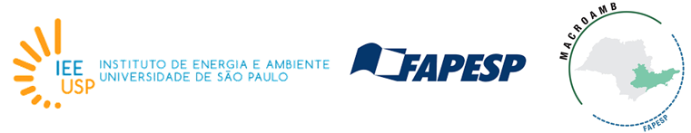
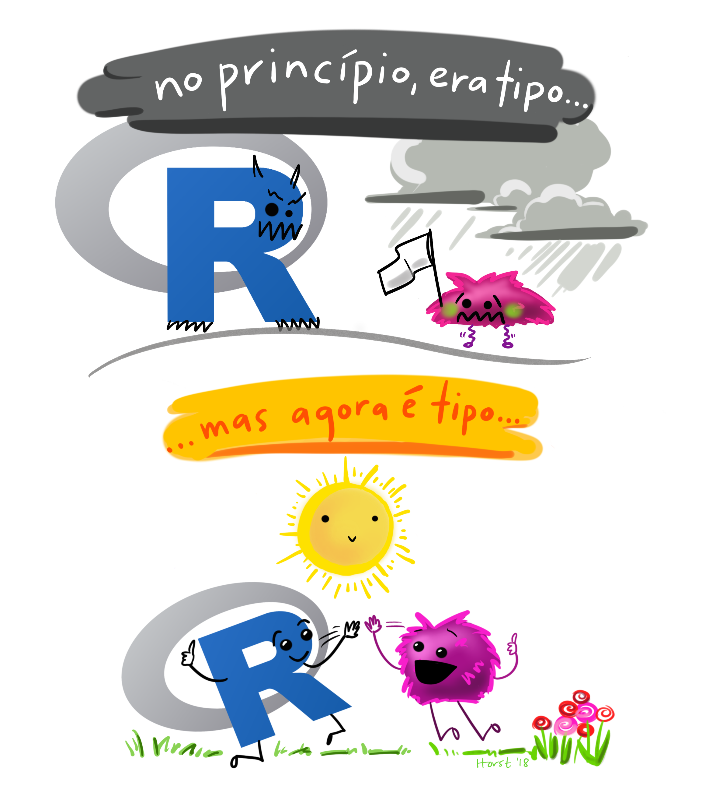

layout: true
  
<div class="my-footer"><span>

twitter: <a href="https://twitter.com/BeaMilz">@BeaMilz</a> - palestra disponível em: <a href="https://bit.ly/neRdzao">bit.ly/neRdzao</a>
</span></div> 

---
class:  center, middle
```{r setup, include=FALSE}
knitr::opts_chunk$set(echo = FALSE, fig.align = "center")
```


## Beatriz Milz
- Doutoranda no Programa de Pós-Graduação em Ciência Ambiental (PROCAM) - Instituto de Energia e Ambiente - Universidade de São Paulo

  - Bolsita FAPESP - Processo nº 2018/23771-6 
  
  - Projeto Temático FAPESP Macroamb - Processo nº 2015/03804-9 
```{r, out.width="80%"}

```

- Equipe da Secretaria Executiva  Editorial - [Revista Ambiente & Sociedade](http://scielo.br/asoc)

- Anteriormente:
  - Mestre em Ciências - UNIFESP
  - Bacharel em Gestão Ambiental - EACH/USP
  
- Co-organizadora - [R-Ladies São Paulo](https://www.meetup.com/pt-BR/R-Ladies-Sao-Paulo)


---
class:  center

```{r, out.width="15%", fig.cap="<center><b>Logo - R-Ladies </center></b>"}
knitr::include_graphics("img/hexlogorladies.jpeg")
```

- R-Ladies é uma organização mundial que **promove a diversidade de gênero** na comunidade da linguagem R.

- R-Ladies São Paulo integra, orgulhosamente, a organização R-Ladies Global, em São Paulo. 

--

- [Código de conduta - R-Ladies](https://github.com/rladies/starter-kit/wiki/Code-of-Conduct#portuguese)

--

- Saiba mais:
  - Website RLadies Global: [https://rladies.org/](https://rladies.org/)
  - Twitter: [@RLadiesGlobal](https://twitter.com/rladiesglobal), [@RLadiesSaoPaulo](https://twitter.com/RLadiesSaoPaulo)
  - Instagram: [@RLadiesSaoPaulo](http://instagram.com/RLadiesSaoPaulo)
  - Facebook: [@RLadiesSaoPaulo](http://facebook.com/RLadiesSaoPaulo)
  - MeetUp: [https://www.meetup.com/pt-BR/R-Ladies-Sao-Paulo](https://www.meetup.com/pt-BR/R-Ladies-Sao-Paulo)
  - Github: [https://github.com/rladies/meetup-presentations_sao-paulo](https://github.com/rladies/meetup-presentations_sao-paulo)

---
class: middle, center

# Dashboards, gráficos, mapas: Possibilidades de visualização de dados com R

<br>
--
<br>

## Para iniciantes :)

---
class: middle, center

# Objetivos:

--

## 1 - O que é R?

--

## 2 - O que são pacotes?

--

## 3 - Quais são os pacotes mais utilizados para visualizações de dados no R?

--

## 4 - Onde estudar?

---
class: middle

# O que é R?

- É uma linguagem de programação

- É também um software gratuito

- Saiba mais em: [r-project.org](https://www.r-project.org/about.html) 

```{r, out.width="50%", fig.cap="<center><b>Logo - R </center></b>"}
knitr::include_graphics("img/R_logo.svg.png")
```

---
class: middle

```{r, out.width="50%", fig.cap="<center><b>Ilustração por Allison Horst - Twitter: <a href='https://twitter.com/allison_horst/'> @allison_horst</a> </b></center>"}

```

---
class: middle

# Pacotes

- Os pacotes são bibliotecas que contém funções e bases de dados.

  - [**CRAN** - The Comprehensive R Archive Network](https://cran.r-project.org/web/packages/)
     + Mais de 14.600 pacotes disponíveis  
     
  - [**Bioconductor** - Open Source Software for Bioinformatics](https://www.bioconductor.org/)
     + Mais de 1.700 pacotes disponíveis 
     
  - [**Github**](https://github.com/)
     + Quantidade desconhecida!

--
- **Quais são os principais pacotes para visualização de dados?**


---
class: middle
- Shiny - dashboards
- flexdashboards
- Rmarkdown 
- ggplot2 - graficos
- highcharter - graficos
- xaringan - apresentacoes
- leaflet - mapas
- bookdown - livros

---
class: middle

# Pacote rmarkdown

```{r, out.width="30%", fig.cap="<center><b>Logo: <a href='https://rmarkdown.rstudio.com'>Pacote rmarkdown</a></b></center>"}
knitr::include_graphics("img/rlogos/hex-rmarkdown.png")
```

- Mantido pela [RStudio](https://rmarkdown.rstudio.com/)

- extensão `.Rmd`

- Possibilita a utilização de códigos R, Markdown, HTML e outros.


---
class: middle

O R é uma linguagem de programação muito utilizada para análise de dados. Existem diversas bibliotecas utilizadas para visualização de dados, como dashboards, apresentações, relatórios dinâmicos, gráficos e mapas interativos. O objetivo desta palestra é apresentar algumas possibilidades de visualização de dados com R.

Exemplo de shiny: https://apps.garrickadenbuie.com/user-2019/
---
class: middle
```{r, out.width="95%", fig.cap="<center><b>Fonte: <a href='https://www.data-to-viz.com/'>From Data to Viz</a></b></center>"}
knitr::include_graphics("img/from-data-to-viz.png")
```

---
class: middle

```{r, out.width="70%", fig.cap="<center><b>Ilustração por Allison Horst - Twitter: <a href='https://twitter.com/allison_horst/'> @allison_horst</a> </b></center>"}
knitr::include_graphics("img/allisonhorst/community1.jpg")
```

---
class:  center, middle

## Obrigada!

```{r, out.width="30%", fig.cap="<center><b>Agradeço à Organização do NerdzãoWeek - Especialmente a <a href='https://twitter.com/tech_jessi'>Jéssica Félix</a></center></b>"}

```


- Contato:

  - Email: <a href="mailto:beatriz.milz@usp.br">beatriz.milz@usp.br</a>
  - Webpage: https://beatrizmilz.com
  - Github: <a href="http://github.com/beatrizmilz">@beatrizmilz</a>
  - Twitter: <a href="http://twitter.com/beatrizmilz">@BeaMilz</a> 
  - Linkedin: <a href="https://www.linkedin.com/in/beatrizmilz">Beatriz Milz</a>


- Apresentação feita com [Xaringan](https://github.com/yihui/xaringan) e [Kunoichi](https://github.com/emitanaka/ninja-theme).
